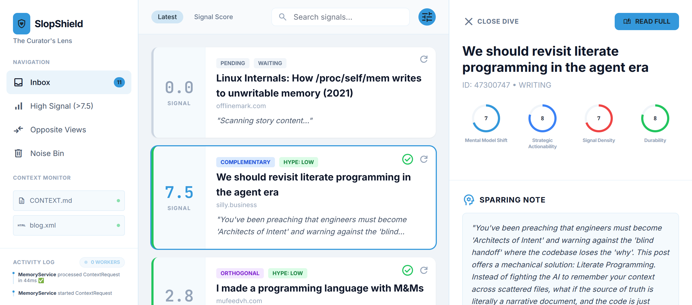

# SlopShield 🛡️

**"Filtering the Firehose through the Lens of Intent."**

SlopShield is a personalized AI "pre-reader" designed to combat **"AI Slop"**—low-signal, high-hype content that dominates modern technical feeds. It uses a personalized "Source of Truth" (such as blog posts, technical drafts, and engineering philosophies) to evaluate the relevance and value of daily content, specifically targeting platforms like Hacker News.



## 🚀 The Mission

In an era of AI-generated filler, SlopShield is designed to:
*   **Maximize Cognitive ROI:** Enable users to spend 5 minutes on high-signal content instead of 60 minutes scrolling.
*   **Maintain Intellectual Integrity:** Explicitly surface "Opposite Views" and "Complementary" ideas while accurately labeling "Echo Chambers."
*   **Detect Hype:** Separate "Hype Surfers" from "Genuine Insight" using a rigorous, personalized scoring rubric.

## 🧠 The Curator (AI Brain)

At the core of the system is **The Curator**, an AI agent that scores content using the custom **SECV Rubric**:
*   **(MMS) Mental Model Shift:** Does this change how the reader thinks?
*   **(SA) Strategic Actionability:** Can the reader make a concrete decision based on it?
*   **(SD) Signal Density:** Is the content "meat" or "fluff"?
*   **(D) Durability:** Will the core concepts still matter in 2 years?

## 📂 Personal Context

SlopShield is entirely driven by your "Personal Context". By default, the `MemoryService` reads from a `context/` directory located in the project root. This directory serves as your "Source of Truth".

### Directory Structure

```text
slop-shield/
├── context/
│   ├── CONTEXT.md       # Your core beliefs, goals, and interests
│   ├── blog.xml         # Your published articles or essays
│   └── drafts.md        # Work-in-progress thoughts
├── app/
...
```

### Example `CONTEXT.md`

To get the most out of the Curator, you must define what matters to you. A simple `CONTEXT.md` might look like this:

```markdown
# Core Philosophy

I believe that all software should be written in punch cards and delivered via carrier pigeon to ensure maximum
durability and intentionality. The cloud is a fad.

# Current Interests

- Vintage typewriter restoration techniques
- Optimizing algorithms for the Commodore 64
- The theoretical applications of competitive cheese-rolling in distributed systems

# Anti-Interests (Noise)

- Anything related to "modern web frameworks" (if it requires npm, it's noise)
- Articles about "synergy", "paradigm shifts", or "leveraging" anything other than a literal crowbar
- Self-driving car updates (I prefer a good horse)
```

The Curator uses this context to determine if a story is a "Complementary" fit, an "Opposite View" worth reading, or just "Irrelevant" noise.

## 🖥️ Dashboard Features

The project includes "The Curator's Lens", a rich, real-time web dashboard used to interact with the analysis engine:
*   **Live Activity Log:** Provides real-time visibility into the internal event stream. It tracks parallel background workers, task execution times, and success rates, fully synchronized with the server via WebSockets.
*   **Inbox & Filtering:** Dynamically sorts and filters stories based on Signal Score or "Opposite Views", allowing users to quickly send low-quality items to the "Noise Bin".
*   **Deep Dive Analytics:** Features a detail pane that provides a granular breakdown of the SECV scores using interactive, descriptive gauges.
*   **AI Reasoning Bullets:** Presents clear, concise explanations generated by the AI detailing *why* a piece of content received its specific scores and alignment rating.
*   **Instant Search:** Allows for real-time filtering of the inbox by title or the AI-generated "Sparring Notes".

## 🏗️ Architecture

SlopShield is built as a **Modular Monolith** in Kotlin/JVM, featuring:
*   **Domain Event Stream:** Utilizes Kotlin Coroutines (`SharedFlow`) to create reactive domain boundaries between the Scout, Harvester, and Strategist components.
*   **MapDB Persistence:** Employs a zero-boilerplate, crash-consistent embedded NoSQL store for data management.
*   **Gemini CLI Integration:** Leverages local AI execution for deep analysis, maintaining privacy and efficiency by utilizing thread-pooling for parallel processing.
*   **Ktor & WebSockets:** Powers the fast, real-time observability and communication layer for the dashboard.

## 🛠️ Getting Started

### Prerequisites
*   JDK 21
*   [Gemini CLI](https://github.com/google/gemini-cli) installed and configured.

### Build & Run
```bash
./gradlew build
./gradlew run
```
Once running, navigate to `http://localhost:8081` in a web browser to view the dashboard.

## 📚 Documentation

For more detailed information, see:
*   [Design Document](docs/slopshield.md) - Deep dive into philosophy and architecture.
*   [Build Plan](docs/build-plan.md) - Incremental development phases.
*   [UI Design Proposal](docs/ui/design_proposal.html) - The original UI specification.
